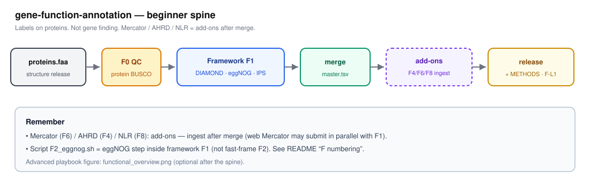

# gene-function-annotation

> **中文教学：** [`docs/zh/`](docs/zh/)（是什么 / 与结构的关系 / 怎么跑 / F线）  
> **English ops:** [`docs/BILINGUAL.md`](docs/BILINGUAL.md)
> **Plant sims (3):** [`examples/plant_sim/`](examples/plant_sim/) — paired with structure (Vitis+NLR / Oryza plain F1 / Solanum+Mercator).


---

## What this repo is

**Label proteins** — names, GO/KEGG-ish maps, domains — **after** gene models exist.

```text
proteins.faa  (from structure release)
        ↓
 F0 QC → F1 (DIAMOND + eggNOG + InterProScan) → merge
        ↓
  functional_master.tsv  +  release/<TAG>/
```

**Not** gene finding / GFF editing — that is upstream  
[`gene-structure-annotation`](https://github.com/Xuzhen-Li/gene-structure-annotation).



Naming note: `pipeline/F2_eggnog.sh` is the **eggNOG step inside default F1**, not the fast-frame branch F2.

## F numbering (one glance)

Four namespaces — do not mix them in speech or METHODS:

| Namespace | Examples | Means |
|-----------|----------|--------|
| **Framework** | F1 / F2 / F3 / F5 | Which whole annotation *frame* you claim (default **F1** = DIAMOND+eggNOG+IPS) |
| **Script filenames** | `F1_diamond.sh`, `F2_eggnog.sh`, `F3_interproscan.sh` | Steps *inside* framework F1 (historical names; **F2_eggnog ≠ framework F2**) |
| **TOOLS cards** | F1a / F1b / F1c | Same three steps as literacy pages (F1b = eggNOG) |
| **Gates** | Gate-F1 … Gate-F7 | Release hard checks (provenance, BUSCO, versions, row counts, …) |

Full Chinese cheat sheet: [`docs/zh/FAQ_入门.md`](docs/zh/FAQ_入门.md). Script renames to semantic names are backlog (②); until then, use this table.

---

## Three steps (start here)

### 1. You already have proteins

If not, finish structure first (its `flow_tool` → GFF + `proteins.faa`).

### 2. Auto-plan the FA frame

```bash
git clone https://github.com/Xuzhen-Li/gene-function-annotation.git
cd gene-function-annotation
cp pipeline/flow_tool/answers.example.yaml my_answers.yaml
# edit: prefer_fast? plant add-ons?
python3 pipeline/flow_tool/flow.py --answers my_answers.yaml -o my_fa_plan.md
```

### 3. Plan tonight; run when you have DBs + compute

**Classroom / honest stop:** finish `my_fa_plan.md` (± list DB disk paths). That is enough for tonight without InterProScan.

**When ready:** [`docs/INSTALL_FUNCTIONAL.md`](docs/INSTALL_FUNCTIONAL.md) → `RUN=1` framework F1 →  
tick [`docs/EVALUATION_CHECKLIST.md`](docs/EVALUATION_CHECKLIST.md) (full rules: [`docs/EVALUATION.md`](docs/EVALUATION.md)). **F-L1** is the acceptance *bar*, not “must finish IPS tonight.”

```bash
cp config/example.env config/local.env
# set PROTEINS_FA to your structure release proteins (one representative per gene)
# set DIAMOND_DB, EGGNOG_*, INTERPROSCAN_HOME, BUSCO_LINEAGE_PROTEIN, …
```

---

## Docs (when needed)

| Need | Open |
|------|------|
| Chinese teaching (short path first) | [`docs/zh/`](docs/zh/) |
| Tool how-tos | [`docs/TOOLS.md`](docs/TOOLS.md) · [`docs/tools/`](docs/tools/) |
| Start here | [`docs/START_HERE.md`](docs/START_HERE.md) |
| Flow tool | [`pipeline/flow_tool/`](pipeline/flow_tool/) |
| Install · **Done?** | [`docs/INSTALL_FUNCTIONAL.md`](docs/INSTALL_FUNCTIONAL.md) · [`docs/EVALUATION_CHECKLIST.md`](docs/EVALUATION_CHECKLIST.md) · [`docs/EVALUATION.md`](docs/EVALUATION.md) |
| QC methods / papers | [`docs/QUALITY_SOURCES.md`](docs/QUALITY_SOURCES.md) |
| Stage I/O · branch map | [`docs/STAGE_IO.md`](docs/STAGE_IO.md) · [`docs/ROADMAP.md`](docs/ROADMAP.md) |
| Walkthrough | [`docs/QUICKSTART.md`](docs/QUICKSTART.md) |

More: [`docs/TUTORIALS_AND_MEETINGS.md`](docs/TUTORIALS_AND_MEETINGS.md) · [`docs/RECENT_HIGH_QUALITY.md`](docs/RECENT_HIGH_QUALITY.md).

<details>
<summary>Advanced overview figure (optional)</summary>


</details>

**Author:** Xuzhen Li · [ORCID](https://orcid.org/0000-0003-3670-6657)
